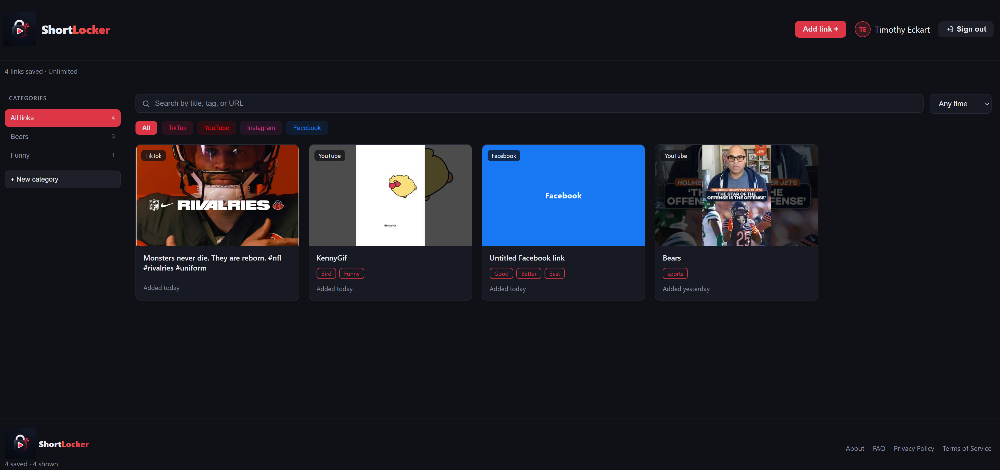
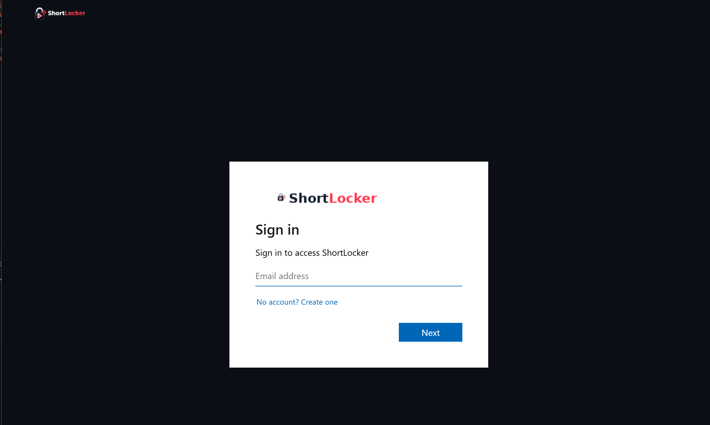
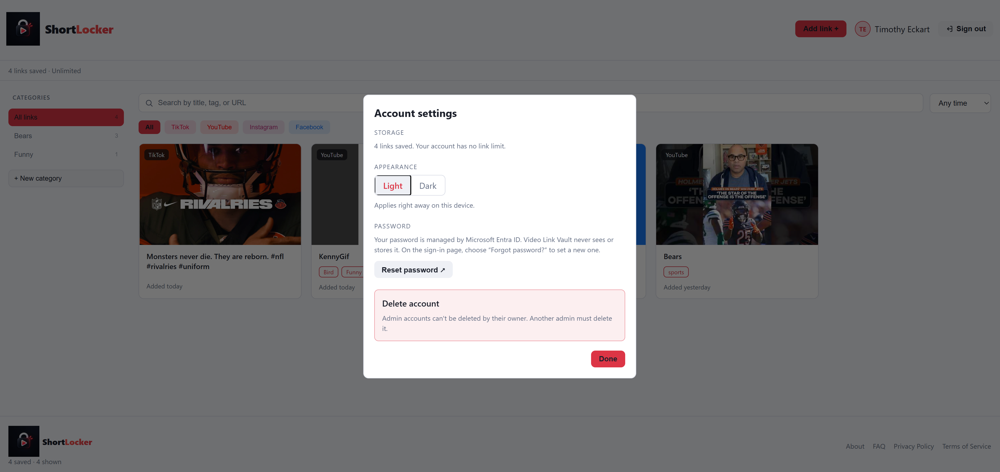
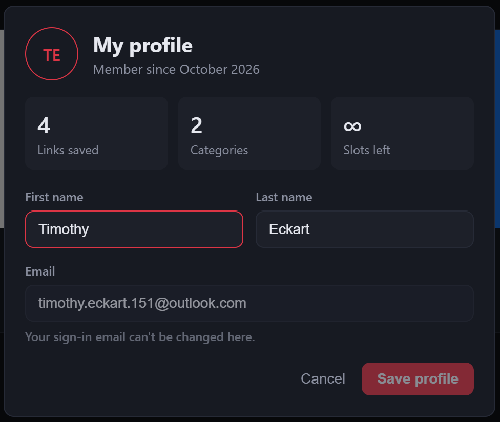

# ShortLocker (Pre-Production Build)

A scaled-down, full-stack practice build of **ShortLocker**: an ASP.NET Core Web API + React app that lets a user register, log in, and save, browse, filter, and delete video links from TikTok, YouTube, Instagram and Facebook — one private vault per account, organized by category and tags. Built as ASP.NET Core / React integration reps ahead of the full ShortLocker capstone project.

> **This repo vs. the live product.** This repo is the scoped, in-memory pre-production build described below — it does not include authentication tokens, a database, or admin tooling. Those were built out in the full capstone project, which shipped as the deployed, publicly usable **[ShortLocker](https://shortlocker.com)**, with real account auth (Microsoft Entra ID), persistent storage (PostgreSQL via EF Core), and admin controls. The feature list and tech stack below describe only what's actually implemented in _this_ repo's code.

## Screenshots

| Landing Page                                         | Vault (13 seeded demo links)                                                                        |
| ---------------------------------------------------- | --------------------------------------------------------------------------------------------------- |
|  |  |

<details>
<summary>More screens</summary>

| Log in                                             | Account Settings                                                        | My Profile                                                  |
| -------------------------------------------------- | ----------------------------------------------------------------------- | ----------------------------------------------------------- |
|  |  |  |

</details>

## Features

- Register / log in / sign out, with a password-visibility toggle
- Per-account vault — three distinct states: logged out, logged in with an empty vault, logged in with data
- Add a link: URL, optional title, auto-detected platform (with manual override), category, comma-separated tags
- Delete a link, with the grid, footer total, and sidebar counts all updating together
- Filter by platform, by user-created category, by free-text search, and by time range — all composable
- User-created categories with live per-category counts
- YouTube thumbnails derived from the video ID, no API call required; other platforms show a placeholder card
- Click a card's thumbnail to open the video in a new tab
- Loading and error states on the link-fetch and delete paths

## Tech Stack

|              |                                                                                               |
| ------------ | --------------------------------------------------------------------------------------------- |
| **Backend**  | C#, .NET 10, ASP.NET Core Web API (controller-based)                                          |
| **Frontend** | React 19 + Vite                                                                               |
| **Storage**  | In-memory (`List<T>`) — no database, by design (see [PRD.md](PRD.md))                         |
| **Auth**     | `Microsoft.AspNetCore.Identity.PasswordHasher<T>` for hashing; no JWT (see Known Limitations) |

## Project Structure

    MSSA_Mini_Project/
    ├── Backend/Backend_Link_Vault/        ASP.NET Core Web API
    │   ├── Models/                        Platform, VideoLink, User
    │   ├── DTO/                           request/response shapes
    │   ├── Services/                      UserStore, VideoLinkStore (in-memory)
    │   ├── Controllers/                   VideoLinksController, AuthController
    │   └── Program.cs                     DI, CORS, JSON config, demo seed
    └── Frontend/Frontend_Link_Vault/      React 19 + Vite
        └── src/
            ├── App.jsx                    links, categories, filters, auth state
            ├── config.js                  API base URL
            └── components/                LinkCard, CategorySidebar, SearchBar,
                                            AddLinkDialog, AuthDialog

Full design rationale, data types, and API endpoint list are in **[PRD.md](PRD.md)**.

## Getting Started

**Backend**

```
cd Backend/Backend_Link_Vault
dotnet run
```

Runs at `https://localhost:7118` by default (confirm the port matches `Frontend/Frontend_Link_Vault/src/config.js`).

**Frontend**

```
cd Frontend/Frontend_Link_Vault
npm install
npm run dev
```

Runs at `http://localhost:5173`.

### Demo login

A demo account is seeded automatically at backend startup:

    Email:    timothy@example.com
    Password: video123

It comes preloaded with 13 sample links across all four platforms so the app is immediately demonstrable after any restart. Note: as an in-memory app, **all data resets when the backend restarts** — the demo account is the exception, since it's reseeded every time.

## API Endpoints

| Method | Route                               | Purpose                   |
| ------ | ----------------------------------- | ------------------------- |
| POST   | `/api/auth/register`                | Create an account         |
| POST   | `/api/auth/login`                   | Log in                    |
| GET    | `/api/videolinks/{userId}`          | List that account's links |
| POST   | `/api/videolinks/{userId}`          | Add a link                |
| DELETE | `/api/videolinks/{userId}/{linkId}` | Delete a link             |

## Known Limitations

This is a scoped mini project (8–12 hour budget), not the capstone — a few gaps are accepted, not oversights:

- **No JWT / token auth** — `{userId}` is taken from the route with nothing to verify ownership. This gap was closed in the capstone with real Microsoft Entra ID authentication.
- **All data is in-memory** — nothing persists across a backend restart except the reseeded demo account. The capstone replaced this with PostgreSQL + EF Core, including a proper repository layer.
- **Thumbnails are YouTube-only** — TikTok, Instagram, and Facebook show a placeholder image (see [PRD.md](PRD.md) for why).

Full reasoning for every design decision and deviation from the original plan is documented in `PRD.md`.

## From pre-production build to shipped product

This repo was the integration rep for a larger idea, and that idea is now live. **[ShortLocker](https://shortlocker.com)** is the deployed capstone build of the same concept — it adds real account authentication (Microsoft Entra ID), persistent PostgreSQL storage behind a proper repository layer, an admin role with moderation tooling, and per-account link limits, and it's hosted on Azure Static Web Apps with a custom domain. None of that lives in this repo; this repo intentionally stays frozen as the smaller, in-memory version it was built as, for reference and for anyone retracing the steps from pre-production build to production app.

## License

MIT — see [LICENSE](LICENSE).
